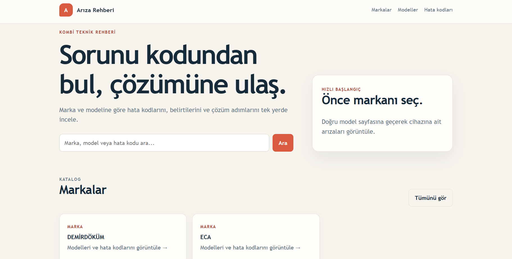
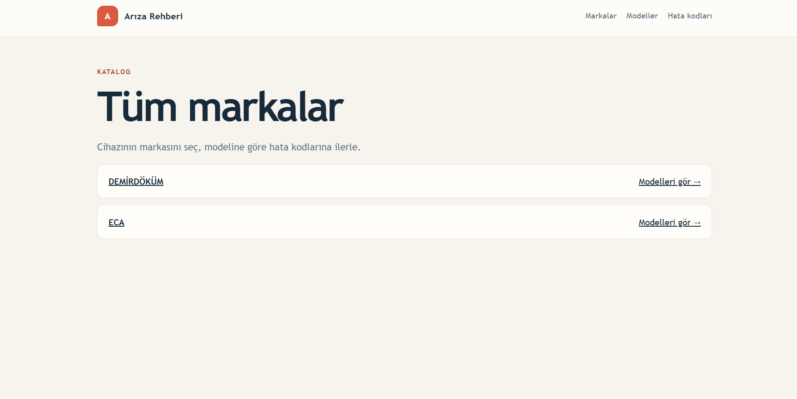
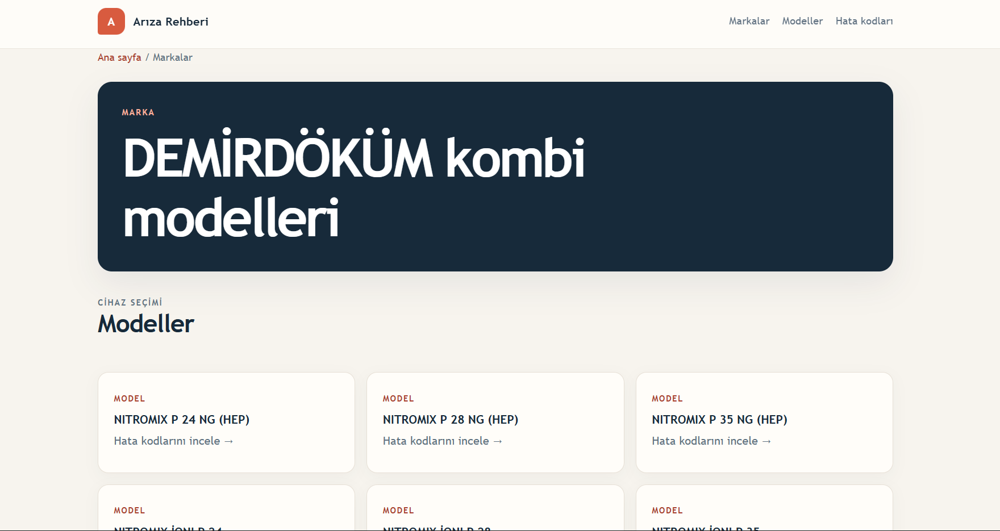
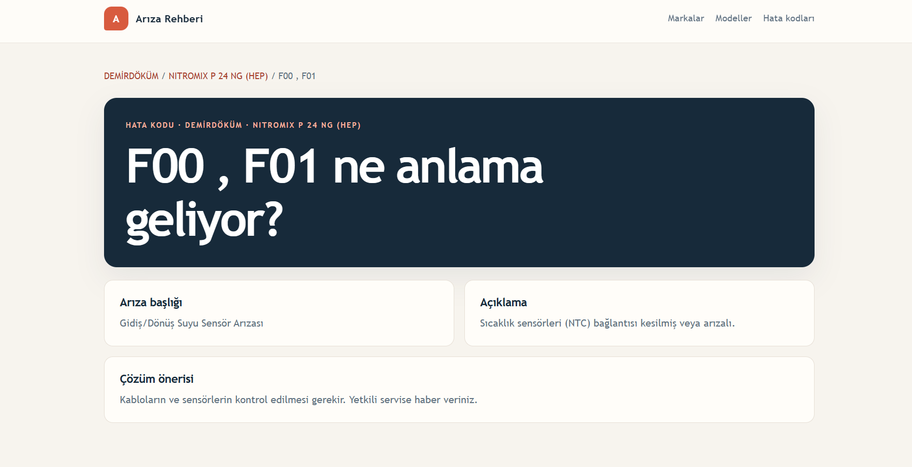
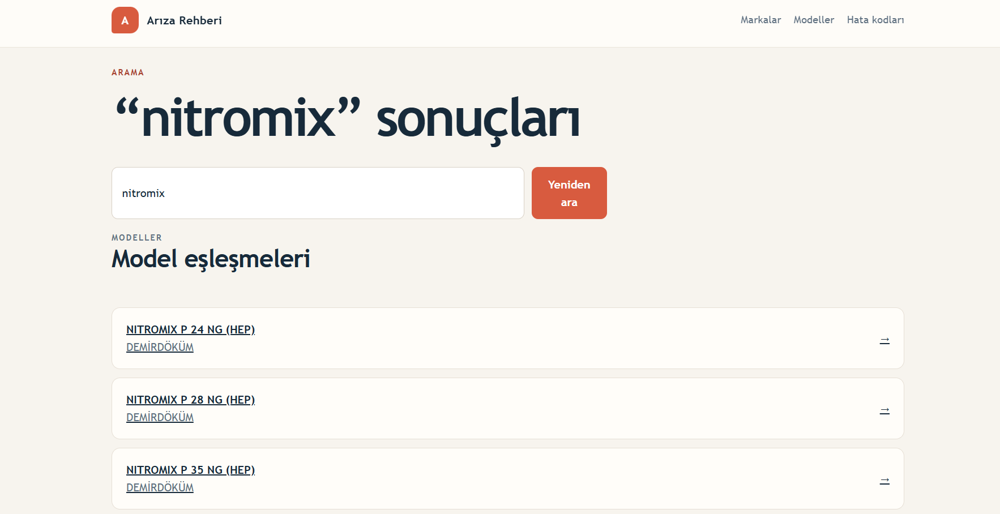
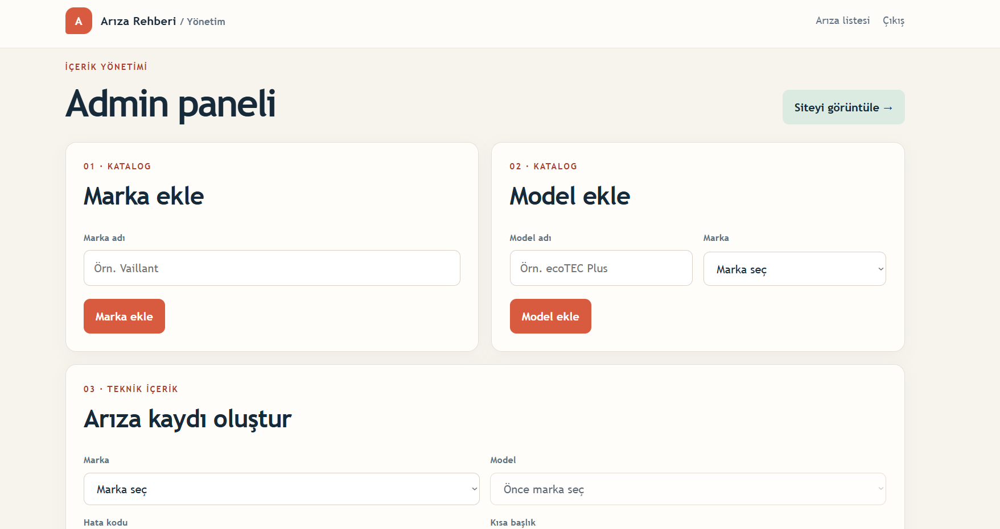
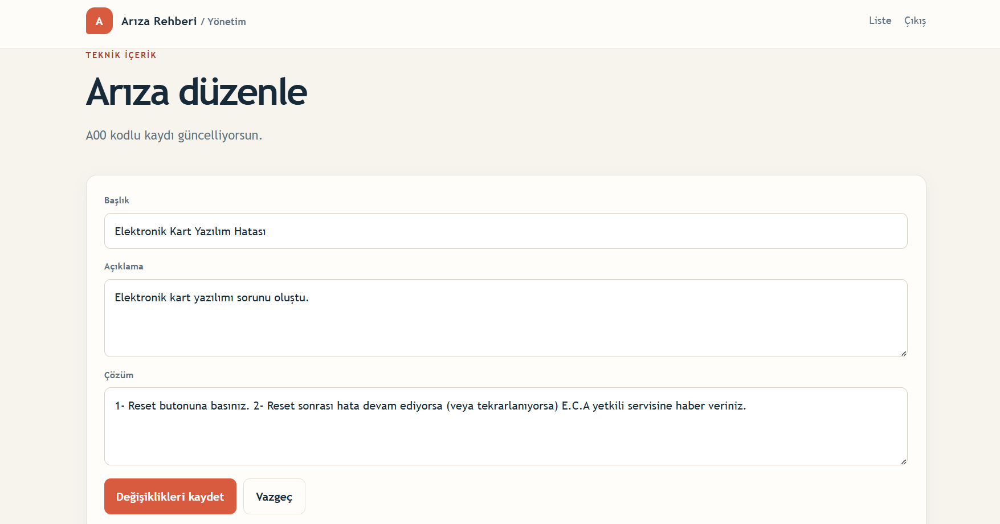

# 🔧 Kombi Arıza Rehberi

Kombi marka, model ve arıza kodlarına göre teknik bilgilerin listelendiği, **Node.js ve MongoDB tabanlı web uygulaması**.

Proje; kullanıcıların belirli bir kombi markası ve modeline ait arıza kodlarını, açıklamalarını ve çözüm önerilerini kolayca bulabilmesini sağlar.

Ayrıca içeriklerin yönetilebilmesi için **oturum tabanlı bir yönetici paneli** bulunmaktadır.

---

## 📸 Ekran Görüntüleri

> Aşağıdaki alanlara uygulamanın gerçek ekran görüntülerini ekleyebilirsin.

### Ana Sayfa



### Marka Listesi



### Model Listesi



### Arıza Kodları Listesi


### Arıza Detay Sayfası



### Arama Sonuçları



### Yönetim Paneli




### Arıza Düzenleme



---

## 🚀 Proje Hakkında

Kombi Arıza Rehberi, kombilerde karşılaşılan hata kodlarını **marka → model → arıza kodu** hiyerarşisi içerisinde sunmak amacıyla geliştirilmiştir.

Kullanıcı bir marka seçerek o markaya ait modelleri görüntüleyebilir, ardından ilgili modelin arıza kodlarına ulaşabilir.

Örneğin:

```text
Marka
  └── Model
       └── Arıza Kodu
            ├── Başlık
            ├── Açıklama
            └── Çözüm
```

Bu yapı sayesinde aynı arıza kodunun farklı marka ve modellerdeki kayıtları birbirinden bağımsız olarak yönetilebilir.

---

## ✨ Özellikler

### 👤 Kullanıcı Tarafı

* Marka listeleme
* Marka bazında model listeleme
* Model bazında arıza kodlarını görüntüleme
* Arıza detay sayfaları
* Arıza kodu, başlık ve açıklama üzerinden arama
* Marka, model ve arıza kayıtlarını ayrı listeleme
* Sayfalama (pagination)
* SEO-friendly URL yapısı
* Responsive web arayüzü

### 🔐 Yönetim Paneli

* Yönetici girişi
* Session tabanlı authentication
* Marka ekleme / silme
* Model ekleme / silme
* Arıza ekleme
* Arıza düzenleme
* Arıza silme
* Yönetici oturumunu sonlandırma

### 🛡️ Güvenlik

* Session tabanlı kimlik doğrulama
* CSRF token kontrolü
* Başarısız giriş denemelerine karşı geçici kilitleme
* IP + kullanıcı bazlı login attempt kontrolü
* HTTP-only session cookie
* `SameSite=Lax` cookie politikası
* Production ortamında `Secure` cookie desteği
* Session regeneration ile login sonrası session fixation riskinin azaltılması
* Ortam değişkenleri üzerinden gizli bilgilerin yönetilmesi
* Arama sorgularında RegExp escape işlemi

### 🐳 Docker

Uygulama ve MongoDB Docker ile birlikte çalışacak şekilde yapılandırılmıştır.

```text
┌─────────────────────┐
│      Node.js        │
│     Express App     │
│      Port 3000      │
└──────────┬──────────┘
           │
           │ MongoDB Driver
           ▼
┌─────────────────────┐
│      MongoDB        │
│     Port 27017      │
│   Persistent Data   │
└─────────────────────┘
```

`docker-compose.yml` içerisinde MongoDB için healthcheck tanımlanmıştır. Uygulama, MongoDB servisinin sağlıklı hale gelmesini bekledikten sonra başlatılır.

---

## 🧰 Kullanılan Teknolojiler

| Teknoloji           | Kullanım Amacı                        |
| ------------------- | ------------------------------------- |
| **Node.js**         | JavaScript runtime                    |
| **Express.js 5**    | Web uygulaması ve routing             |
| **EJS**             | Server-side HTML rendering            |
| **MongoDB**         | Veritabanı                            |
| **Mongoose**        | MongoDB ODM                           |
| **Express Session** | Oturum yönetimi                       |
| **Docker**          | Uygulama container'ı                  |
| **Docker Compose**  | Uygulama + MongoDB orchestration      |
| **dotenv**          | Ortam değişkenlerinin yönetimi        |
| **Nodemon**         | Geliştirme sırasında otomatik restart |

---

## 🏗️ Proje Mimarisi

Uygulama, Express üzerinde route tabanlı bir yapı kullanmaktadır.

```text
kombi-ariza-rehberi/
│
├── models/
│   ├── Ariza.js
│   ├── Marka.js
│   └── Model.js
│
├── routes/
│   └── routes.js
│
├── views/
│   ├── index.ejs
│   ├── marka-detay.ejs
│   ├── model-detay.ejs
│   ├── ariza-detay.ejs
│   ├── arama-sonuc.ejs
│   ├── admin.ejs
│   ├── admin-login.ejs
│   └── ...
│
├── public/
│   └── ...
│
├── app.js
├── seed.js
├── Dockerfile
├── docker-compose.yml
├── package.json
└── .env
```

### Katmanların Görevi

**Models**

MongoDB verilerinin şemalarını ve ilişkilerini tanımlar.

**Routes**

HTTP isteklerini karşılar, veritabanından gerekli verileri alır ve ilgili EJS view'larını render eder.

**Views**

Kullanıcı ve yönetici arayüzlerini oluşturur.

**Public**

CSS, JavaScript ve diğer statik dosyaları içerir.

**Seed**

Başlangıç verilerinin MongoDB'ye aktarılması için kullanılır.

---

## 🗄️ Veritabanı Yapısı

Uygulamada üç temel MongoDB modeli bulunmaktadır:

### Marka

```text
Marka
├── _id
├── name
├── slug
├── servisTelefon
├── servisAdres
├── servisEmail
└── servisWeb
```

### Model

```text
Model
├── _id
├── name
├── slug
└── marka → Marka ObjectId
```

### Arıza

```text
Arıza
├── _id
├── marka → Marka ObjectId
├── model → Model ObjectId
├── kod
├── baslik
├── aciklama
├── cozum
└── tarih
```

Model ve arıza kayıtları MongoDB `ObjectId` referansları ile markalara ve modellere bağlanmaktadır.

Mongoose `populate()` kullanılarak ilişkili marka ve model bilgileri gerektiğinde birlikte getirilmektedir.

---

## 🔗 URL Yapısı

Projenin önemli noktalarından biri marka ve model bilgilerini URL içerisinde taşıyan yapılandırılmış route sistemidir.

### Marka

```text
/markalar/:markaslug
```

Örnek:

```text
/markalar/demirdokum
```

### Model

```text
/markalar/:markaslug/:modelslug
```

Örnek:

```text
/markalar/demirdokum/isofast-hk-35-hermetik
```

### Arıza

```text
/markalar/:markaslug/:modelslug/:kod
```

Örnek:

```text
/markalar/demirdokum/isofast-hk-35-hermetik/F01
```

Bu yapı hem kullanıcı açısından okunabilir URL'ler oluşturur hem de içeriklerin arama motorları tarafından daha anlaşılır şekilde kategorize edilmesine yardımcı olur.

---

## 🔎 Arama Sistemi

Uygulamada ayrı bir arama endpoint'i bulunmaktadır:

```text
/arama?q=...
```

Arama sistemi;

* Arıza kodu
* Arıza başlığı
* Açıklama
* Çözüm
* Marka adı
* Model adı

üzerinden sonuç üretmektedir.

Ayrıca bazı özel arama ifadeleri doğrudan ilgili listeleme sayfalarına yönlendirilir.

Örneğin:

```text
markalar
modeller
hata kodları
arızalar
```

gibi sorgular ilgili sayfalara yönlendirilir.

Arama sorgularında kullanıcı tarafından girilen RegExp karakterleri escape edilerek kontrolsüz regular expression kullanımının önüne geçilmeye çalışılmıştır.

---

## 🔐 Authentication ve Güvenlik

Yönetim paneli `/admin` endpoint'i üzerinden korunmaktadır.

Yetkisiz kullanıcılar:

```text
/admin
```

adresine erişmeye çalıştığında:

```text
/admin-login
```

sayfasına yönlendirilir.

### Session

`express-session` kullanılarak yönetici oturumu tutulmaktadır.

Session cookie ayarlarında:

```javascript
httpOnly: true
sameSite: "lax"
```

kullanılmaktadır.

Production ortamında ayrıca:

```javascript
secure: true
```

aktif hale getirilmektedir.

### CSRF Koruması

POST isteklerinde session içerisinde oluşturulan CSRF token kontrol edilmektedir.

Token karşılaştırması:

```javascript
crypto.timingSafeEqual()
```

kullanılarak yapılmaktadır.

### Login Rate Limiting

Başarısız yönetici girişleri için:

```text
5 başarısız deneme
        ↓
15 dakika kilitleme
```

mekanizması bulunmaktadır.

Kontrol hem kullanıcı/IP kombinasyonu hem de IP bazında yapılmaktadır.

Başarılı giriş sonrasında session yeniden oluşturularak mevcut session üzerinden kimlik doğrulama yapılmaktadır.

---

## 🐳 Docker ile Çalıştırma

Projeyi Docker ile çalıştırmak için Docker Desktop'ın kurulu olması gerekir.

### 1. Projeyi klonla

```bash
git clone https://github.com/canyilmaz959/kombi-ariza-rehberi.git
cd kombi-ariza-rehberi
```

### 2. `.env` dosyasını oluştur

Proje kök dizininde:

```env
SESSION_SECRET=guclu-bir-session-secret
ADMIN_USER=admin
ADMIN_PASSWORD=guclu-bir-sifre
```

### 3. Container'ları başlat

```bash
docker compose up --build
```

Uygulama:

```text
http://localhost:3000
```

adresinde çalışacaktır.

MongoDB ise:

```text
mongodb://localhost:27017
```

üzerinden erişilebilir.

---

## 🌱 Seed Verileri

Projede başlangıç verilerini MongoDB'ye aktarmak için `seed.js` bulunmaktadır.

Seed script'i:

1. MongoDB bağlantısı kurar.
2. Marka kaydını kontrol eder.
3. Modelleri oluşturur.
4. Arıza kodlarını ilgili model ile ilişkilendirir.
5. Aynı kayıtların tekrar eklenmesini önler.

Çalıştırmak için:

```bash
node seed.js
```

Örneğin seed yapısında marka → model → arıza kodu ilişkisi oluşturulmaktadır.

---

## 📂 Önemli Dosyalar

| Dosya                | Açıklama                                |
| -------------------- | --------------------------------------- |
| `app.js`             | Express uygulamasının başlangıç noktası |
| `routes/routes.js`   | Kullanıcı ve admin route'ları           |
| `models/Marka.js`    | Marka MongoDB modeli                    |
| `models/Model.js`    | Model MongoDB modeli                    |
| `models/Ariza.js`    | Arıza MongoDB modeli                    |
| `seed.js`            | Başlangıç verilerini oluşturur          |
| `Dockerfile`         | Node.js container image tanımı          |
| `docker-compose.yml` | Node.js + MongoDB servisleri            |
| `views/`             | EJS sayfaları                           |
| `public/`            | Statik frontend dosyaları               |

---

## 📊 Veri Bütünlüğü

Arıza modelinde:

```javascript
arizSchema.index(
    { kod: 1, marka: 1, model: 1 },
    { unique: true }
);
```

şeklinde compound unique index kullanılmaktadır.

Böylece aynı:

```text
Marka + Model + Arıza Kodu
```

kombinasyonunun birden fazla kez oluşturulması engellenir.

---

## 🧩 Geliştirme Yaklaşımı

Projede özellikle aşağıdaki backend konuları üzerinde çalışılmıştır:

* RESTful route tasarımı
* Server-side rendering
* MongoDB veri modelleme
* Mongoose ilişkileri
* CRUD işlemleri
* Session authentication
* CSRF protection
* Login rate limiting
* Input validation
* RegExp escaping
* Pagination
* Slug oluşturma
* Environment variable kullanımı
* Docker containerization
* Docker Compose ile servis yönetimi

---

## 🛠️ Gelecek Geliştirmeler

Projenin ilerleyen aşamalarında aşağıdaki özelliklerin eklenmesi planlanabilir:

* [ ] Daha gelişmiş arama ve filtreleme
* [ ] Marka/model bazlı SEO metadata yönetimi
* [ ] Sitemap ve robots.txt
* [ ] Daha gelişmiş admin yetkilendirme sistemi
* [ ] Kullanıcı rolleri
* [ ] Görsel yönetimi
* [ ] Arıza içerikleri için zengin metin editörü
* [ ] API endpoint'leri
* [ ] Test altyapısı
* [ ] Production logging
* [ ] Merkezi error handling
* [ ] Production MongoDB deployment
* [ ] CI/CD pipeline

---

## 📌 Proje Durumu

**Durum:** 🟢 Tamamlandı

Proje bireysel olarak geliştirilmiştir ve backend, veritabanı, yönetim paneli ve Docker altyapısını içeren bir web uygulaması olarak tasarlanmıştır.

---

## 👨‍💻 Geliştirici

**Can Yılmaz**

Bilgisayar Programcılığı mezunu
Backend & Web Development

* GitHub: [@canyilmaz959](https://github.com/canyilmaz959)

---

## 📄 Lisans

Bu proje kişisel portföy ve eğitim amacıyla geliştirilmiştir.
